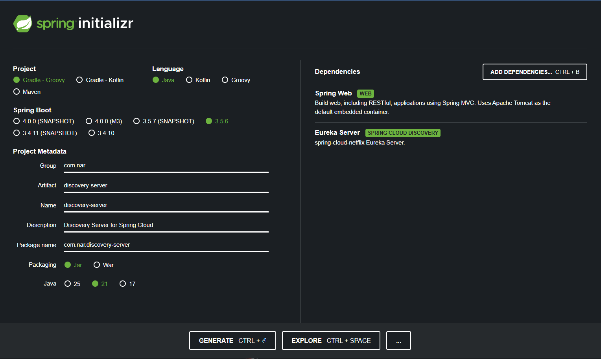
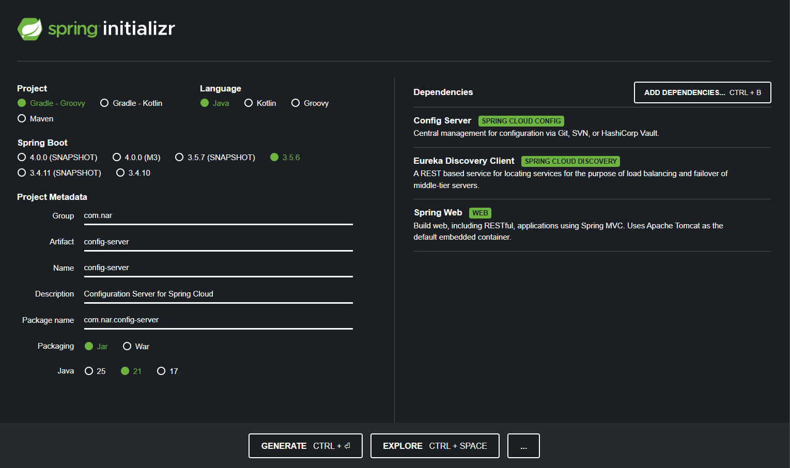
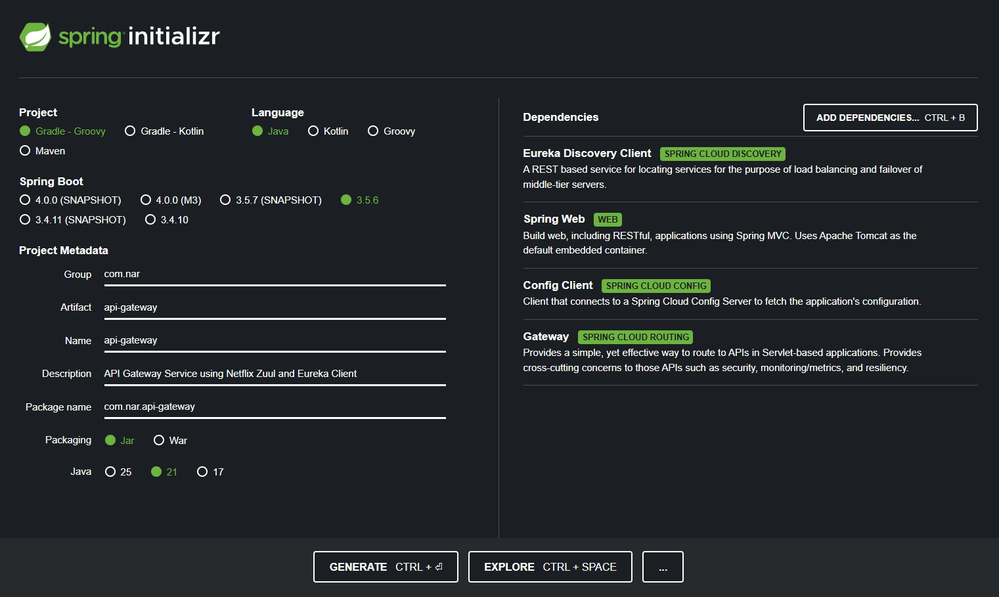

<!-- NAR -->

<p align="center">
  <a href="docs/assets/nar-transparent-texted.png" target="_blank">
    <picture>
      
    </picture>
  </a>
</p>

# Nar

Welcome to the **Nar** project! It is a modern, lightweight, and opinionated micro-starter for Spring Boot projects. Nar is designed to help developers quickly bootstrap small and modular Spring Boot applications while following best practices.

## Why "Nar"?

**Nar** means "pomegranate" in Turkish. This symbolic choice represents our core philosophy:

- **🌱 Modularity** — Like pomegranate seeds, each component is self-contained yet part of a greater whole
- **🚀 Growth Potential** — Every seed can flourish into a new application
- **🛡️ Resilience** — Protected by a robust architectural shell
- **⚡ Abundance** — Packed with features and possibilities

Just as a pomegranate's tough exterior protects countless seeds within, Nar provides a solid foundation that can expand into scalable, distributed ecosystems.

---

## Table of Contents

- [Nar](#nar)
  - [Why "Nar"?](#why-nar)
  - [Table of Contents](#table-of-contents)
  - [Built With](#built-with)
  - [Key Features](#key-features)
  - [Development Guide](#development-guide)
    - [1. Prerequisites](#1-prerequisites)
    - [2. Installation](#2-installation)
    - [3. Project Setup](#3-project-setup)
    - [4. Environment Variables](#4-environment-variables)
  - [Architecture](#architecture)
  - [Release Notes](#release-notes)
  - [Roadmap](#roadmap)
  - [Development Workflow](#development-workflow)
  - [Code of Conduct](#code-of-conduct)
  - [Security Policy](#security-policy)
  - [Contributing](#contributing)
  - [Contact](#contact)

## Built With

- [Spring Boot 3.5.6](https://projects.spring.io/spring-boot/) - Inversion of Control Framework
- [Spring Cloud](https://spring.io/projects/spring-cloud) - For building robust cloud-native applications
- [Spring Eureka](https://spring.io/projects/spring-cloud-netflix) - Service Discovery
- [Spring Zuul](https://spring.io/projects/spring-cloud-netflix) - API Gateway
- [Spring Config](https://spring.io/projects/spring-cloud-config) - Centralized Configuration Management
- [Spring Web](https://spring.io/projects/spring-framework) - Web Framework
- [Gradle](https://gradle.org/) - Dependency Management

## Key Features

- **Modular Architecture**: Each service is self-contained, promoting separation of concerns and easier maintenance.
- **API Gateway**: Centralized entry point for all client requests, handling routing, security, and rate limiting.
- **Service Discovery**: Automatic detection of services using Netflix Eureka.
- **Centralized Configuration**: Manage application settings across all services with Spring Cloud Config.
- **Security**: Integrated Spring Security for robust authentication and authorization mechanisms.
- **Database Integration**: Pre-configured with PostgreSQL and Hibernate for seamless data management.
- **Containerization**: Docker and Docker Compose support for easy deployment and scaling.

## Development Guide

### 1. Prerequisites

- [Java 21](https://www.oracle.com/java/technologies/javase-jdk21-downloads.html)
- [Gradle](https://gradle.org/install/)
- [Visual Studio Code (Recommended)](https://code.visualstudio.com/download)
- [IntelliJ IDEA (Optional)](https://www.jetbrains.com/idea/download/)
- [Postman](https://www.postman.com/downloads/)
- [Git](https://git-scm.com/downloads)

> **Note**: The project uses Java 21, so make sure to have the correct version installed. You can check the Java version using the following command:

```bash
java -version
```

> **Note**: The project uses IDEs like Visual Studio Code, IntelliJ IDEA, etc. for development. You can use any IDE of your choice. However, **VSCode** is recommended for this project.

### 2. Installation

- Clone the repository

```bash
git clone <repository-url>
```

- Open the project in your favorite IDE

- **Note**: The project uses **Auto Save** settings for Visual Studio Code and IntelliJ IDEA. Make sure to enable the **Auto Save** settings for the IDEs.

- **Visual Studio Code**:
  - Go to File -> Preferences -> Settings
  - Type **Auto Save** in the search bar and select **afterDelay** from the dropdown
- **IntelliJ IDEA**:
  - Go to File -> Settings -> Build, Execution, Deployment -> Compiler
  - Check the box for **Build project automatically**
  - Apply and OK

```bash
# For Visual Studio Code
code .

# For IntelliJ IDEA
idea .
```

- Install Lombok Plugin in IntelliJ IDEA (**If you are using Visual Studio Code, you can skip this step**)
  - Open IntelliJ IDEA
  - Go to File -> Settings -> Plugins
  - Search for Lombok Plugin
  - Install and Restart IntelliJ IDEA
  - Enable Annotation Processing
  - Go to File -> Settings -> Build, Execution, Deployment -> Compiler -> Annotation Processors
  - Check the box for Enable annotation processing
  - Apply and OK

- Install Spotless Plugin in IntelliJ IDEA (**If you are using Visual Studio Code, you can skip this step**)
  - Open IntelliJ IDEA
  - Go to File -> Settings -> Plugins
  - Search for Spotless Plugin
  - Install and Restart IntelliJ IDEA

### 3. Project Setup

- Open the project in your favorite IDE
- Run the project using the following command:

```bash
# For Windows
./start-all.bat

# For Unix-based systems (Linux, macOS)
chmod +x start-all.sh
./start-all.sh
```

> **Note**: The above scripts will start all the services in the correct order with necessary delays. It will also check for port availability and health status of each service before starting the next one.
> **Make sure to run the scripts in a terminal that supports bash (e.g., Git Bash, WSL, etc.) for Windows users.**

- If you want to start each service individually, you can use the following commands:

```bash
# 1. Start Discovery Server first
cd discovery-server && ./gradlew bootRun

# 2. Wait 30 seconds, then start Config Server
cd ../config-server && ./gradlew bootRun

# 3. Wait 20 seconds, then start API Gateway  
cd ../api-gateway && ./gradlew bootRun
```

### 4. Environment Variables

The following environment variables can be customized as necessary:

- **Discovery Server** (`discovery-server/src/main/resources/application.properties`):
- **Configuration Server** (`config-server/src/main/resources/application.properties`):
- **API Gateway** (`api-gateway/src/main/resources/application.properties`):

## Architecture

The project is structured in a layered architecture with the following layers:

```bash
.
├── api-gateway
│   ├── src
│   │   ├── main
│   │   │   ├── java
│   │   │   │   └── com
│   │   │   │       └── nar
│   │   │   │           ├── ApiGatewayApplication.java  # Main application class
│   │   │   ├── resources
│   │   │   │   ├── application.properties              # Application properties
│   │   │   │   └── bootstrap.properties                # Bootstrap properties
├── config-server
│   ├── src
│   │   ├── main
│   │   │   ├── java
│   │   │   │   └── com
│   │   │   │       └── nar
│   │   │   │           ├── ConfigServerApplication.java # Main application class
│   │   │   ├── resources
│   │   │   │   ├── config
│   │   │   │   │   └── api-gateway.yml
│   │   │   │   ├── application.properties               # Application properties
│   │   │   │   └── bootstrap.properties                 # Bootstrap properties
├── discovery-server
│   ├── src
│   │   ├── main
│   │   │   ├── java
│   │   │   │   └── com
│   │   │   │       └── nar
│   │   │   │           ├── DiscoveryServerApplication.java # Main application class
│   │   │   ├── resources
│   │   │   │   ├── application.properties               # Application properties
│   │   │   │   └── bootstrap.properties                 # Bootstrap properties
├── docs                                                 # Holds project documentations. Markdown sections, etc.
│   └── assets
```





> **Note**: The above diagram is a simplified representation of the project structure. Each service (discovery-server, config-server, api-gateway) is a separate Spring Boot application with its own main class and resources. For more details, please refer to the [ARCHITECTURE.md](docs/ARCHITECTURE.md) document.

---

## Release Notes

Please refer to the [RELEASE_NOTES.md](docs/RELEASE_NOTES.md) for the project release notes and changelog.

## Roadmap

Please refer to the [ROADMAP.md](docs/ROADMAP.md) for the project roadmap and future plans.

## Development Workflow

In the **Nar** project, we follow a structured development workflow to ensure efficient collaboration and code management. This workflow includes the following key components: branching strategy, versioning, and commit message conventions. By following these guidelines, we aim to maintain a clean and organized codebase that is easy to manage and contribute to. For more information, please refer to the [Development Workflow](docs/DEVELOPMENT_WORKFLOW.md) document.

## Code of Conduct

Please read the [Code of Conduct](docs/CODE_OF_CONDUCT.md) before contributing to the project.

## Security Policy

Please read the [Security Policy](docs/SECURITY.md) before contributing to the project.

## Contributing

Please read [CONTRIBUTING.md](https://gist.github.com/PurpleBooth/b24679402957c63ec426)
for details on our code of conduct, and the process for submitting pull requests to us.

## Contact

Thanks to the following people who have contributed to this project:

- [Yunus Emre Alpu](https://www.linkedin.com/in/yunus-emre-alpu-5b1496151/) - Creator and Maintainer
