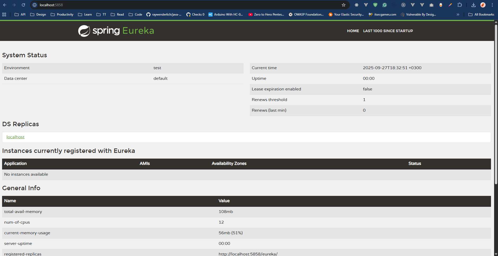

# Architecture

This document outlines the architecture of our microservices-based application, which leverages Spring Cloud components to ensure scalability, resilience, and maintainability.

## Discovery Server (Eureka) [5858]

The Discovery Server is built using Spring Cloud Netflix Eureka. It serves as a service registry where all microservices register themselves and discover other services. This enables load balancing and failover capabilities.

## Configuration Server [5859]

The Configuration Server is developed using Spring Cloud Config. It provides a centralized configuration management solution, allowing microservices to fetch their configuration properties from a shared repository. This ensures consistency and simplifies configuration updates across all services.

## API Gateway [5860]

The API Gateway is implemented using Spring Cloud Netflix Zuul. It acts as a single entry point for all client requests, routing them to the appropriate microservices. The gateway also handles cross-cutting concerns such as authentication, logging, and rate limiting.
